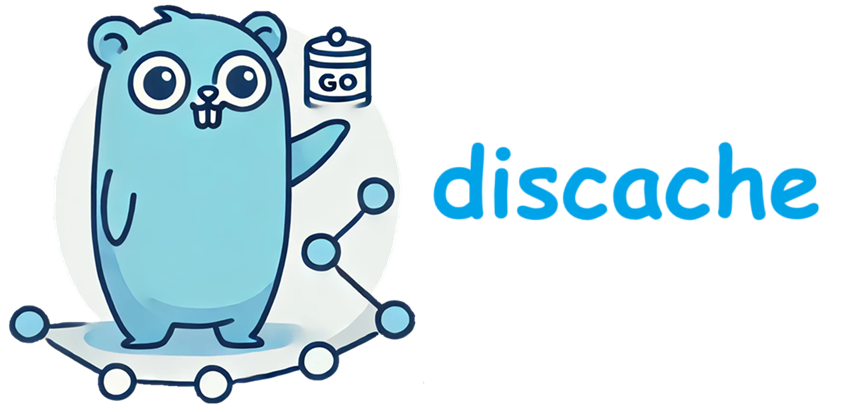

# Discache : Distributed LRU Cache
[](https://github.com/dhyanio/discache/actions/workflows/go.yml)
[](https://github.com/dhyanio/discache/actions/workflows/go.yml)
[](https://goreportcard.com/report/github.com/dhyanio/discache)

[](https://opensource.org/licenses/MIT)




Discache, is a powerfull, but simple LRU cache in golang. Using TCP and binary as a transporter which makes it very performant.

## CLI
A CLI tool has commands

### Requirements
- Go (version 1.17 or later)

### Makefile Targets
#### Variables
- `LISTEN_ADDR` - Address for the server to listen on (default: `:4000`).
- `LEADER_ADDR` - Address of the leader node (default: `:3000`).

These can be passed as arguments when running specific commands.

### Usage
- Build the Project

```bash
make build
```
Builds the Go binary and places it in the bin/ directory.

- Run the Project

```bash
make run
```
Runs the binary after building it.

- Run the Tests

```bash
make test
```
Runs all tests with verbose output.

- Lint the Project

```bash
make lint
```
Runs golangci-lint on the codebase. Ensure golangci-lint is installed.

- Format the Code

```bash
make fmt
```
Formats the code using go fmt.

- Clean the Build Files

```bash
make clean
```
Removes the bin/ directory and all generated files.

### Example Usage
To start a leader
```bash
make run NAME:node1 LISTEN_ADDR=:3000
```

To start a follower node with a custom `LISTEN_ADDR` and `LEADER_ADDR`
```bash
make leader NAME=node1 LISTEN_ADDR=:3000 Leader_NAME=node1
```

## Client
A Go client for connecting to an LRU cache server over TCP. This client allows users to perform Get and Put operations on the cache, handling network communication and TTL (time-to-live) for cache entries.

## 🔧 Features
- Get: Retrieve a value by its key.
- Put: Store a value with a specified TTL.
- Connection Management: Establishes and closes TCP connections.
- Error Handling: Returns detailed error messages for failed operations.

## 🚀 Installation
- Prerequisites: Make sure you have Go installed.
- Clone the repository and navigate to the project directory.
- Build the Client:

```bash
go build -o lru_client client.go
```
## 📚 Usage
#### Initialize the Client
To create a new client instance, use New with the server endpoint and optional configurations:

```go
import "github.com/dhyanio/discache/client"

func main() {
    endpoint := "localhost:9080" // port 9080 is default for discache client server
    opts := client.Options{}
    client, err := client.New(endpoint, opts)
    if err != nil {
        log.Fatalf("Failed to connect to discache server: %v", err)
    }
    defer cacheClient.Close()
}

```

#### Using Get and Put Methods
`Put` a key-value pair into the cache with a specified TTL (in seconds):

```go
key := []byte("foo")
value := []byte("bar")
ttl := 60 // TTL in seconds

err := client.Put(context.Background(), key, value, ttl)
if err != nil {
    log.Printf("Failed to put key: %v", err)
}
```

`Get` a value by key:

```go
value, err := client.Get(context.Background(), key)
if err != nil {
    log.Printf("Failed to get key: %v", err)
} else {
    log.Printf("Value: %s", string(value))
}
```
#### Close the Client
Always close the connection when you're done:

```go
defer cacheClient.Close()
```

## ❗Error Handling
Errors returned by `Get` and `Put` methods include:

- `Key Not Found`: if the key doesn’t exist.
- `Connection Errors`: issues in TCP communication with the server.
- `Non-OK Status`: unexpected server responses.

## 🤝 Contributing
Contributions are welcome! Please open an issue or submit a pull request on GitHub.
1. Fork the repository.
2. Create your feature branch (git checkout -b feature/new-feature).
3. Commit your changes (git commit -am 'Add new feature').
4. Push to the branch (git push origin feature/new-feature).
5. Create a new Pull Request.

## 📜 License

This project is licensed under the MIT License. See the [LICENSE](LICENSE) file for details.

## ❤️ Acknowledgements

Thanks to the Go community for their support and contributions.